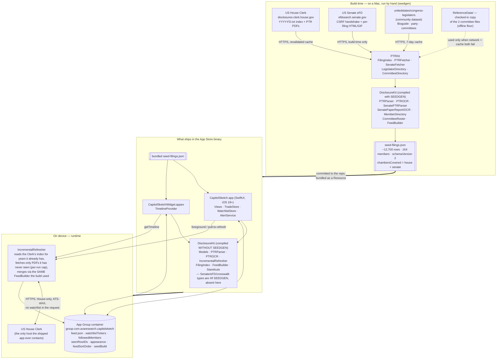

# CapitolSketch — infrastructure

There is no server. This document is the whole of the infrastructure: a build-time
program that bakes a snapshot, a binary that ships it, and an on-device refresher that
tops it up by talking to one government file server and nobody else.

It exists to make two guarantees mechanically true, not just intended:

1. **Every reader sees the identical public record.** The app ships one file. No request
   it makes is shaped by the watchlist, the followed-members list, or anything else about
   the reader. Two phones on the same app build issue the same requests in the same order.
2. **Nothing about the reader leaves the device.** No account, no analytics, no
   third-party SDK, no backend to send to. The watchlist is a `UserDefaults` array in an
   App Group container.

---

## The whole system

---

## Build time — `Tools/PTRKit/Sources/seedgen`

`seedgen` runs on a developer's Mac. `swift run seedgen --years 2025,2026 --senate --out CapitolSketch/Resources/seed-filings.json`. It:

1. Loads the **`congress-legislators`** crosswalk (`legislators-current` + `legislators-historical`) → a `MemberDirectory` that resolves a printed name + seat to a Bioguide ID, and carries **party** and the member's common name. Cached 7 days.
2. Loads the **committee files** (`committees-current`, `committee-membership-current`) → `CommitteeRoster` (Bioguide → full-committee names). A **checked-in copy** under `Tools/PTRKit/Sources/PTRKit/ReferenceData/` is the offline floor: used only when both the network and the cache miss, and `seedgen` logs loudly when it fires.
3. Reads the **House Clerk** index (`{year}FD.txt`, revalidated not trusted), keeps `FilingType == "P"`, fetches each PTR PDF, and runs it through `PTRParser` — with `PTROCR` (Vision) as a fallback for scanned pages, flagged lower-confidence.
4. With `--senate`, does the **eFD** CSRF handshake and pulls each Senate PTR. Electronic reports parse via `SenatePTRParser`; **paper reports are hand-marked scans that OCR cannot read reliably** (`SenatePaperOCR` proved it) — they are counted as unreadable, the same as an unreadable House scan, and never invented.
5. Folds it all together with `FeedBuilder` — the **same code the on-device merge runs** — de-dups, attaches committees and party by Bioguide, and writes one JSON file.

The output, `seed-filings.json`, is committed to the repo. Regenerating it is a deliberate act, reviewed as a diff.

## What ships in the binary — and what does not

`DisclosureKit` is one Swift package compiled two ways:

| Compiled **with** `SEEDGEN` (macOS / `seedgen` / tests) | Compiled **without** `SEEDGEN` (the iOS app + widget) |
|---|---|
| `SenateFilingIndex`, `SenateFetcher`, `SenatePTRParser`, `SenatePaperReport`, `SenatePaperOCR`, `MemberDirectory.resolve`, `CommitteeRoster` | everything else: `Models`, `PTRParser`, `PTROCR`, `FilingIndex`, `IncrementalRefresher`, `FeedBuilder`, `Standouts`, `TradeCollections` |

`Package.swift` sets `.define("SEEDGEN", .when(platforms: [.macOS]))`. The eFD scraper, the CSRF handshake, and the crosswalk resolver **are not in the shipped binary at all** — they cannot be, the code isn't compiled in. Xcode builds this package for iOS when compiling the app, where the condition is false.

The `congress-legislators` files (tens of MB) never ship either — the seed already carries the answer for every member it saw.

## Runtime — on device

- **The app and the widget both read the bundled `seed-filings.json`**, then prefer a newer `feed.json` written into the **App Group container** (`group.com.avaresearch.capitolsketch`) by a refresh. `discardCacheIfBuildChanged` drops that cache whenever the app build number changes, so a new build's seed always wins on first launch.
- **`IncrementalRefresher`** (House-only) runs on foreground / pull-to-refresh, and from the widget's `getTimeline`. It asks the Clerk's index which PTRs exist for the years the snapshot already covers, fetches only the PDFs it has never seen (with a per-run cap), parses them with the shipped `PTRParser`, and merges with `FeedBuilder`. Which requests it makes depends only on **what the snapshot holds and today's date** — never the watchlist.
- **The App Group container** holds the feed cache and the reader's state: `watchlistTickers`, `followedMembers`, `seenRowIDs`, `appearance`, `feedSortOrder`, `lastClerkContact`, `seedBuildVersion`. All local. The keys are deliberately un-branded so a future rename needs no migration.
- **Alerts** are local notifications fired by the app when an unseen filing matches a watched ticker or followed member. `AlertService`. The match runs on-device against data already downloaded.
- There is **no `BGTaskScheduler`** — the app only refreshes while open (or when the widget's timeline runs).

## Every network call the shipped app can make

Exhaustive. All HTTPS, all ATS-strict (`NSAllowsArbitraryLoads` = false), all to one host:

| Caller | Request | Host |
|---|---|---|
| `IncrementalRefresher` | `GET /public_disc/financial-pdfs/{year}FD.txt` (index, with `ETag` revalidation) | `disclosures-clerk.house.gov` |
| `IncrementalRefresher` | `GET` one PTR PDF per newly-seen filing | `disclosures-clerk.house.gov` |
| Settings links | opens the Clerk portal / the asset-type-code reference in Safari (user-initiated) | `disclosures-clerk.house.gov`, `fd.house.gov` |
| `ShareLink` on a filing | hands the OS the filing's public URL to share (no network by the app) | — |

Senate data arrives only baked into the seed. The on-device refresher stays House-only, which is stated in the UI; Senate filings are 45-day-lagged already, and refresh in the next app update.

## Where each North Star is enforced

| Guarantee | Enforced by |
|---|---|
| Same record for every reader | `IncrementalRefresher` and the widget provider take no watchlist input; `Standouts` and every `TradeFeed` function read only `TradeFeed`; a test pins `Standouts.byCategory` determinism |
| Nothing about the reader leaves the device | no backend exists; no analytics/third-party SDK; watchlist is `UserDefaults`; notification copy says the ticker list never leaves the phone; Privacy Nutrition Label = **None** |
| From primary sources | `seedgen` reads the Clerk and eFD directly; the one third-party dataset (`congress-legislators`) is build-time only, degrades gracefully, and is named in the App Review notes and README |
| No unsupported coverage claim | paper Senate filings counted-not-invented; the data-quality screen states what's missing and why; House-only on-device refresh is stated on screen |
| Reproducible build | the seed is committed; the crosswalk's committee files have a checked-in offline floor; `xcodegen` generates the `.xcodeproj` from `project.yml` (the `.xcodeproj` is git-ignored) |

## What never happens

- No server owned by this project, anywhere.
- No request whose shape depends on the watchlist, followed members, or the reader's identity.
- No exact dollar figures or computed returns — the form states a bracket, and that is all the app shows.
- No party colour, no party aggregate, no "who's winning" ranking. Party and chamber are plain text tags.
- No background fetch. No push. No `BGTaskScheduler`.
