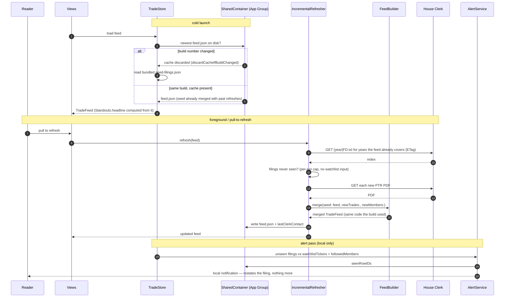

# CapitolSketch — architecture

There is no server. The whole system is a build-time program that bakes a snapshot, an
iOS binary that ships it, and an on-device refresher that tops it up by talking to one
government file server and nobody else.

It is shaped to make two guarantees **mechanically** true, not just intended:

1. **Every reader sees the identical public record.** The app ships one file. No request
   it makes is shaped by the watchlist, the followed-members list, or anything else about
   the reader. Two phones on the same build issue the same requests in the same order.
2. **Nothing about the reader leaves the device.** No account, no analytics, no
   third-party SDK, no backend to send to. The watchlist is a `UserDefaults` array in an
   App Group container.

Four views follow: the **system** end to end, the **code** in layers, the **build &
release** pipeline, and the **runtime** data flow.

---

## 1 · System overview

---

## 2 · Code architecture

Three Swift modules. `DisclosureKit` is the shared core, compiled two different ways.
`PTRKit` and `seedgen` are the Mac-only build tools. The app and widget are thin.

```mermaid
flowchart TB
    subgraph APP["CapitolSketch (app target)"]
        direction TB
        appmod["App/ — CapitolSketchApp · AppShortcuts"]
        views["Views/ — Feed · Standouts · Members · Watchlist<br/>TradeDetail · Filing · DataQuality · About · Components"]
        data["Data/ — TradeStore · WatchlistStore · AlertService<br/>NotificationCoordinator · AppearanceStore · AppIconStore"]
        appmodels["Models/ — Copy · Presentation"]
        views --> data
        data --> appmodels
    end

    subgraph WIDGET["CapitolSketchWidget (app-extension target)"]
        wprovider["CapitolSketchWidget — TimelineProvider"]
    end

    subgraph SHARED["Shared/ (compiled into both targets)"]
        shared["SharedContainer · Theme · Direction<br/>TradeRelevance · AppIntents"]
    end

    subgraph DK["DisclosureKit (SwiftPM package — the core)"]
        direction TB
        models["Models · DisclosedAmount · CalendarDate<br/>TradeIdentity · TradeCollections"]
        engine["FeedBuilder · Standouts · FilingIndex"]
        refresh["IncrementalRefresher · PTRParser · PTROCR<br/>PTRFetcher · VisionText"]
        gated["#if SEEDGEN only:<br/>SenateFilingIndex · SenateFetcher · SenatePTRParser<br/>SenatePaperReport · SenatePaperOCR<br/>MemberDirectory · CommitteeRoster · MemberNameMatch"]
        engine --> models
        refresh --> engine
        gated --> engine
    end

    subgraph BUILDTOOLS["Mac-only build tools"]
        seedgen["seedgen — main.swift (executable)"]
        ptrkit["PTRKit — LegislatorDirectory · CommitteeDirectory<br/>+ ReferenceData/ checked-in committee files"]
        seedgen --> ptrkit
    end

    APP --> SHARED
    WIDGET --> SHARED
    APP --> DK
    WIDGET --> DK
    SHARED --> DK
    seedgen --> DK
    ptrkit --> DK

    style gated stroke-dasharray: 5 5
    style BUILDTOOLS fill:transparent
```

`Package.swift` sets `.define("SEEDGEN", .when(platforms: [.macOS]))` and the test target
turns it on explicitly. When Xcode compiles `DisclosureKit` for iOS the flag is off, so
the eFD scraper, the CSRF handshake, and the `congress-legislators` resolver are **not in
the shipped binary at all** — the code does not compile in. The dashed box above is the
line between "runs on a Mac at build time" and "ships to a phone."

| Compiled **with** `SEEDGEN` — macOS, `seedgen`, tests | Compiled **without** `SEEDGEN` — the iOS app + widget |
|---|---|
| `SenateFilingIndex`, `SenateFetcher`, `SenatePTRParser`, `SenatePaperReport`, `SenatePaperOCR`, `MemberDirectory`, `CommitteeRoster`, `MemberNameMatch` | everything else: `Models`, `PTRParser`, `PTROCR`, `PTRFetcher`, `FilingIndex`, `IncrementalRefresher`, `FeedBuilder`, `Standouts`, `TradeCollections`, `TradeIdentity` |

---

## 3 · Build & release pipeline

Every step below happens on one developer's Mac and in GitHub. There is no CI service in
the loop and nothing is generated on a server.

```mermaid
flowchart LR
    subgraph SOURCES["Primary sources"]
        s1["House Clerk index + PTR PDFs"]
        s2["Senate eFD PTRs (--senate)"]
        s3["congress-legislators crosswalk + committees"]
    end

    s1 & s2 & s3 --> seedgen["swift run seedgen --years 2025,2026 --senate<br/>--out CapitolSketch/Resources/seed-filings.json"]
    seedgen --> review{"review the JSON diff<br/>row counts · coverage report<br/>new / removed trades"}
    review -->|"looks right"| commit["git commit seed-filings.json<br/>+ bump CURRENT_PROJECT_VERSION in project.yml<br/>+ AboutView doc · release notes"]
    review -->|"anomaly"| seedgen

    commit --> push["push to github.com/AvaJ845/CapitolSketch (main)"]
    push --> pages["GitHub Pages redeploys index.html<br/>avaj845.github.io/CapitolSketch"]

    commit --> xcodegen["/Users/dj/bin/xcodegen generate<br/>project.yml -> CapitolSketch.xcodeproj (git-ignored)"]
    xcodegen --> archive["Xcode ▸ Product ▸ Archive<br/>Release · generic/platform=iOS · automatic signing"]
    archive --> validate["Organizer ▸ Validate<br/>-validate-for-store"]
    validate --> upload["upload to App Store Connect"]
    upload --> tf["TestFlight<br/>public link testflight.apple.com/join/wVbrbDT5"]
    tf --> asc["App Store review<br/>version record must match MARKETING_VERSION (1.1.0)"]
    asc --> store["App Store — 'coming soon'"]
```

Facts that pin this down:

- **`project.yml` is the source of truth**; `.xcodeproj` is git-ignored and disposable.
  `info: { path: Info.plist, properties: {…} }` means xcodegen **overwrites**
  `CapitolSketch/Info.plist` from `project.yml` on every generate.
- **Version keys** live in `project.yml` only: `MARKETING_VERSION` (`1.1.0`) and
  `CURRENT_PROJECT_VERSION` (`5`), on both the app and widget target. `Info.plist` carries
  `$(MARKETING_VERSION)` / `$(CURRENT_PROJECT_VERSION)` and resolves them at build.
- **`seedgen` timing:** House PDFs cache in `$TMPDIR/ptrfetch-cache`; the Senate eFD
  portion has no cache and re-runs (~4 min) every time. A cold run is ~8 min.
- **Regenerating the seed is a deliberate act, reviewed as a diff.** The committed
  `seed-filings.json` is the reproducible artifact — the build never fetches at compile
  time.
- Bundle id `com.avaresearch.capitolsketch` (widget `.widget`); team `3L683975L8`;
  `TARGETED_DEVICE_FAMILY` `1,2`; iOS 18 deployment target; App Group
  `group.com.avaresearch.capitolsketch`.

---

## 4 · Runtime data flow

What happens on the phone, from a cold launch through a refresh and an alert. The
widget's `getTimeline` follows the same right-hand path.

Notes:

- **`IncrementalRefresher` is House-only.** It contacts `disclosures-clerk.house.gov` and
  no other host. Senate rows are frozen at seed-generation time and only advance when a
  new build ships a regenerated seed — stated on the data-quality screen. Senate filings
  are 45-day-lagged by law, so this is acceptable.
- **The refresh request shape depends only on what the snapshot holds and today's date** —
  never on the watchlist or followed members. That is what makes guarantee 1 mechanical.
- **`FeedBuilder.merge` is the same function `seedgen` uses.** The seed and any later
  device merge cannot disagree about de-duplication or identity.
- **No `BGTaskScheduler`, no push.** The app refreshes only while open, or when the
  widget timeline runs.

---

## Every network call the shipped app can make

Exhaustive. All HTTPS, all ATS-strict (`NSAllowsArbitraryLoads` = false), all to one host:

| Caller | Request | Host |
|---|---|---|
| `IncrementalRefresher` | `GET /public_disc/financial-pdfs/{year}FD.txt` — index, `ETag` revalidation | `disclosures-clerk.house.gov` |
| `IncrementalRefresher` | `GET` one PTR PDF per newly-seen filing | `disclosures-clerk.house.gov` |
| Settings / detail links | opens the Clerk portal or the asset-type-code reference in Safari (user-initiated) | `disclosures-clerk.house.gov`, `fd.house.gov` |
| `ShareLink` on a filing | hands the OS the filing's public URL to share (no network by the app) | — |

The Senate eFD (`efdsearch.senate.gov`) and `congress-legislators` are contacted **only by
`seedgen`, on a Mac, at build time.** The shipped binary has no code path to either.

---

## Where each guarantee is enforced

| Guarantee | Enforced by |
|---|---|
| Same record for every reader | `IncrementalRefresher` and the widget provider take no watchlist input; `Standouts` and every `TradeFeed` function read only `TradeFeed`; a test pins `Standouts.byCategory` determinism |
| Nothing about the reader leaves the device | no backend exists; no analytics / third-party SDK; watchlist is `UserDefaults`; notification copy says the ticker list never leaves the phone; Privacy Nutrition Label = **None** |
| From primary sources | `seedgen` reads the Clerk and eFD directly; the one third-party dataset (`congress-legislators`) is build-time only, degrades to a checked-in copy, and is named in the App Review notes and README |
| No unsupported coverage claim | paper Senate filings counted-not-invented; the data-quality screen states what is missing and why; House-only on-device refresh is stated on screen |
| Reproducible build | the seed is committed; the committee files have a checked-in offline floor; `xcodegen` regenerates the `.xcodeproj` from `project.yml` |

## What never happens

- No server owned by this project, anywhere.
- No request whose shape depends on the watchlist, followed members, or the reader's identity.
- No exact dollar figures or computed returns — the form states a bracket, and that is all the app shows.
- No party colour, no party aggregate, no "who's winning" ranking. Party and chamber are plain text tags.
- No background fetch. No push. No `BGTaskScheduler`. No in-app purchase.
